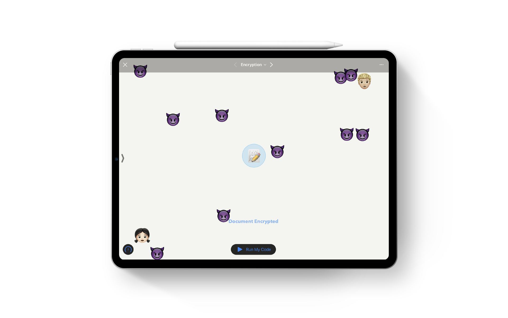

# Nina's Playground ⛳️
#### Submission for Apple WWDC'20 Swift Student Challenge!
#### ✨🧑🏻‍💻 Accepted! 🧑🏻‍💻✨

 

#### Swift Playgrounds Book to demonstrate the modern RSA encryption mechanism using an intuitive game and a prototype safe environment for kids using basics of Machine Learning and Natural Language Processing to detect spam, negative sentiments and protect them from mature content online.

## Introduction 📝
- This playground book consists of three pages which showcase various use of technology in our daily lives.
- The first page uses SpriteKit to make a small yet fun game which demos the underlying mechanism of encryption in the modern world.
- The second page imports a custom NLP model trained in CoreML and uses it to detect spam and protect user from malicious mails.
- The third page imports a custom NLP model trained in CoreML to detect sentiments from the statements made by the user. It is used to inform the parent/guardian if the user is carrying negetive sentiments.

 

Technologies used to build this playground book:
 
`UIKit` `CoreML` `SpriteKit` `CoreAnimation` 
 
`NLP Models` | [Stanford - Sentiments](http://ai.stanford.edu/~amaas/data/sentiment/) | [DT-Campinas - SpamFilter](http://www.dt.fee.unicamp.br/~tiago/smsspamcollection/) |

 

## Installation 📦

To build the project make sure you have atleast Xcode 11.4.1 installed. 
You can install the `.playgroundbook` file on Swift Playground 3.3 on Mac or iPad.

 

## License 🔏

See `LICENSE`
